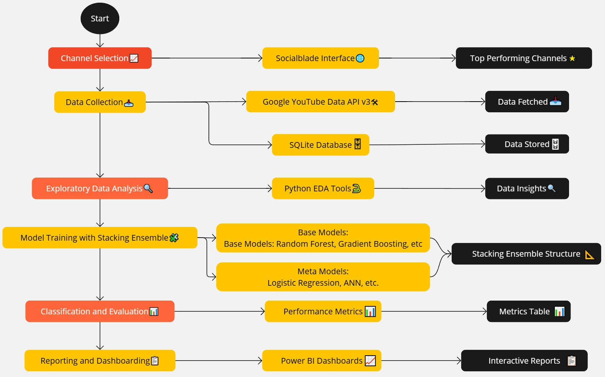
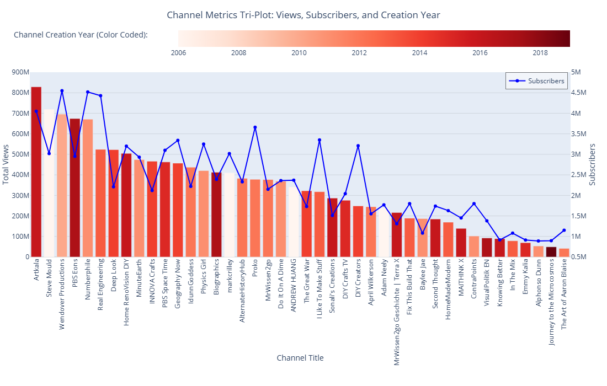
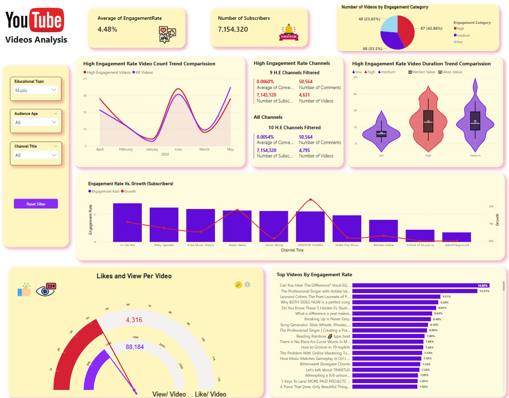

# YouTube Channel and Video Performance Analysis

## Research Problem

Assume you are a broadcaster or someone looking to develop a massive open online course (MOOC), and you need to understand the dynamics of "Educational" video streamers. This includes insights into audience preferences, video content, and streamer performance. While YouTube's Analytics dashboard in YouTube Studio offers robust tools for channel owners, it lacks the ability to analyze competitors or obtain comprehensive market insights. Long vs. For instance, how do audiences engage with long versus short DIY topic vs Social Science topic?

Using the limited capabilities of the Google YouTube Data API v3, this project provides a unique opportunity to explore and uncover valuable insights from competitor channels. By analyzing engagement rates, video duration, upload frequency, and audience reactions through sentiment analysis of comments, this project aims to deliver a comprehensive view of the educational video landscape. Such competitive insights are rarely available on a single public platform, making this project a significant endeavor for anyone looking to outperform their rivals and optimize their content strategy.

## Project Overview

<div style="text-align: center;">
    <a href=results/project_process_diagram.jpg" target="_blank">
        
    </a>
</div>
### Data Collection and Preprocessing

- **Data Sources**: YouTube Data API v3, Social Blade
- **Data Cleaning**: Removing videos with very low views (1-3), handling missing values, converting data types, and feature engineering.

### Exploratory Data Analysis (EDA)

- **Correlation Analysis**: Examined correlations between features and engagement rates to select relevant features and remove highly correlated ones.
- **Visualization**: Used Plotly and Power BI to visualize data distributions and relationships.

### Modeling and Evaluation

- **Model Selection**: Used a Stacking Ensemble method with models like XGBoost, LightGBM, and Gradient Boosting.
- **Hyperparameter Tuning**: Employed Optuna for efficient hyperparameter optimization.
- **Evaluation Metrics**: Accuracy, precision, recall, F1 score, ROC AUC.

### Sentiment Analysis

- **Sentiment Analysis**: Analyzed the sentiment of comments to investigate its correlation with engagement rates using TextBlob.  (Note: This step needs more modifications in the version 1, and would be improved by July 2024)

### Dashboard and Visualization

- **Power BI Dashboard**: Created an interactive dashboard to present the findings visually.
- **Plotly Visualizations**: Generated visualizations for exploratory data analysis and model evaluation.
- Below are some sample visualizations: (Click on images to zoom!)
An EDA step for some Channels:
  
<div style="text-align: center;">
    <a href="results/channels_triple_plot.png" target="_blank">
        
    </a>
</div>
PowerBI Dashboard:

<div style="text-align: center;">
    <a href="results/PowerBI_Dashboard.jpg" target="_blank">
        
    </a>
</div>

## Requirements

- Python 3.x
- YouTube Data API v3 Credentials (preferably with extra Quote) 
- pandas, numpy, xgboost, lightgbm, optuna, Plotly, seaborn, scikit-learn, TextBlob
- PowerBI

## Setup and Installation

1. Clone the repository:
   ```bash
   git clone https://github.com/MortezaEmadi/YouTube-Channel-and-Video-Performance-Analysis-using-Google-API-and-Stacking-Ensemble-Classifier.git
   cd yt-channel-analysis
   ```

2. Install the required packages:
   ```bash
   pip install -r requirements.txt
   ```

3. Run the preprocessing script:
   ```bash
   python src/preprocess.py
   ```

4. Run the EDA and analysis script:
   ```bash
   python src/eda_and_analyze.py
   ```

5. Train and evaluate the model:
   ```bash
   python src/stacking_ensemble_model.py
   ```

6. Generate visualizations:
   ```bash
   python src/visualize.py
   ```

7. Launch the PowerBI dashboard:
   Open `YouTube Videos Analysis_V2.pbit` in PowerBI Desktop and refresh the data source.
   
8. The `results` folder contains images and other outputs from the analysis and model evaluation steps.


## Key Outcomes

By understanding the dynamics of video engagement and sentiment, this research aims to offer actionable strategies for content creators to maximize their impact on YouTube. Develop interactive dashboards to present findings and deliver a comprehensive report with insights and recommendations.

## Limitations

While this project provides extensive insights, it is crucial to note that engagement on social media platforms involves complex metrics. However, Enagagement Rate by View, Conversation Rate and others discussed in the projects are main essential ones for YouTube analytics.

## Areas for Improvement

1. **Automation:** To be a full end-to-end solution, the entire process from data collection to dashboard creation should be much more automated using tools like Apache Airflow. This includes scheduling data updates, automating preprocessing and modeling steps, and refreshing the dashboard. Also, deploying the model in platforms like Flask or cloud services (AWS, GCP, Azure) would be useful in next steps.
2. **User Interaction:** Adding a user interface or making the dashboard interactive to allow users to explore different aspects of the data dynamically would enhance the end-to-end nature of the project.

## Contributing

Contributions are welcome! Please fork this repository and submit pull requests for any enhancements or bug fixes.

## License

This project is licensed under the MIT License.

## Acknowledgements

Thanks to the open-source community and various data science resources that have contributed to the development of this project.
```
